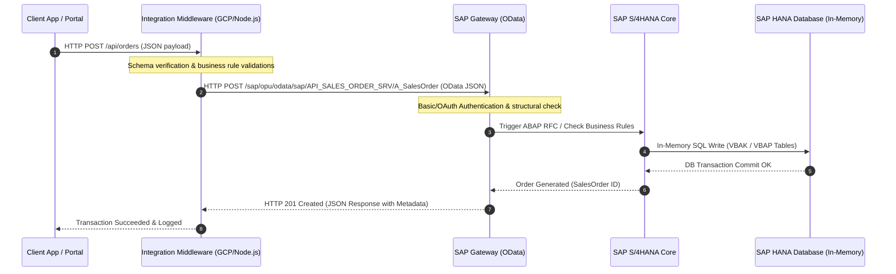

# Rafhan Maize - SAP S/4HANA Integration Portal & Middleware Architecture

This repository contains the architecture blueprints, technical documentation, and interactive prototype for connecting **Rafhan Maize Products Co. Ltd.** industrial milling systems, customer-facing applications (e.g., "Rafhan Maize Link"), and AI analytics layers with **SAP S/4HANA** via the standard OData Gateway Service layer.

---

## Table of Contents
1. [Business Overview: Rafhan Maize Products Co. Ltd.](#1-business-overview-rafhan-maize-products-co-ltd)
2. [SAP S/4HANA Architecture & Integration Pattern](#2-sap-s4hana-architecture--integration-pattern)
3. [SAP Digital Access Licensing Model](#3-sap-digital-access-licensing-model)
4. [Standard SAP S/4HANA OData APIs & Schema Mappings](#4-standard-sap-s4hana-odata-apis--schema-mappings)
5. [Data Validation & Middleware Integrity Rules](#5-data-validation--middleware-integrity-rules)
6. [Interactive Simulation Sandbox Guide](#6-interactive-simulation-sandbox-guide)

---

## 1. Business Overview: Rafhan Maize Products Co. Ltd.

**Rafhan Maize Products Co. Ltd.** (PSX: **RMPL**) is one of the largest agricultural processors and corn refiners in Pakistan, operating as a key affiliate of the global food ingredients leader **Ingredion Incorporated (USA)**. 

Rafhan Maize processes raw corn (maize) grains through industrial wet milling to manufacture a wide variety of B2B ingredients utilized across more than 50 industries (Food, Confectionery, Pharmaceuticals, Textile sizing, Paperboard, Oil Drilling, Animal Feed, and Adhesives).

### Key B2B Product Categories
* **Maize Starches:** Standard Maize Starch, Tex-O-Film (textile sizing starch), Amioca (specialty food starch), Yellow/White Dextrins (industrial glues).
* **Sweeteners & Glucose:** Liquid Glucose (corn syrup), Dextrose Monohydrate (pharmaceutical-grade dextrose).
* **Animal Nutrition & Co-products:** Gluten Meal (60% protein feed-stock), Gluten Feed (30% protein feed-stock), Maize Bran, Maize Germ.

### Staging Plant Locations
* **Faisalabad Plant (HQ):** Major wet milling facility and central administrative base.
* **Jhang Plant:** Modern starch refining and derivative processing plant.
* **Karachi Sales Hub:** Primary export shipping point and Southern sales office.

---

## 2. SAP S/4HANA Architecture & Integration Pattern

Unlike legacy ERP setups using direct database queries or outdated RFC/BAPI layers, Rafhan Maize utilizes a decoupled **API-First Middleware Architecture** interfacing directly with **SAP S/4HANA** via the **SAP Gateway (NetWeaver)** using standard OData REST services.

---

## 3. SAP Digital Access Licensing Model

In modern SAP environments (specifically S/4HANA), integrating external applications like client portals, mobile apps (e.g., "Rafhan Maize Link"), or automated plant IoT devices can introduce compliance risks if not licensed correctly.

### Named User vs. Digital Access
SAP enforces strict rules regarding **Indirect Access** (data entered or queried by non-SAP systems on behalf of users). Under S/4HANA, Rafhan Maize employs the official **SAP Digital Access** model:

* **No Named Users for Portals:** External customers placing orders on the web portal do not require costly S/4HANA Professional/Limited named user licenses.
* **Document-Based Charging:** Licensing costs are calculated based on the net count of "documents" created directly in SAP by external systems. 
* **Supported Core Documents:** The 9 document types tracked under this model include Sales Documents (created via OData), Financial Documents, and Purchase Documents.

This ensures 100% legal compliance with SAP auditing while keeping software overhead low.

---

## 4. Standard SAP S/4HANA OData APIs & Schema Mappings

The Integration Middleware translates JSON payloads from external systems into standardized S/4HANA OData structures.

### 4.1 Sales Order API (`API_SALES_ORDER_SRV`)
Responsible for creating and tracking sales orders for Refined Starch, Dextrin, and Liquid Glucose exports.
* **Entity Type:** `A_SalesOrder` (Header)
* **Underlying SAP DB Tables:** `VBAK` (Header), `VBAP` (Lines)

#### Header Mapping (`VBAK`)
| Middleware Field | SAP OData Property | Data Type | Description |
| :--- | :--- | :--- | :--- |
| `orderId` | `SalesOrder` | String(10) | SAP unique Sales Document Number (Auto-assigned) |
| `orderType` | `SalesOrderType` | String(4) | Sales Document Type (e.g. `TA` for Standard Order) |
| `customerCode` | `SoldToParty` | String(10) | Sold-to customer ID (BUT000/KNA1 mapping) |
| `orderDate` | `SalesOrderDate` | DateTime | Posting date of the sales document |
| `currency` | `TransactionCurrency`| String(5) | Document transaction currency (`PKR`, `USD`, etc.) |
| `poNumber` | `PurchaseOrderByCustomer` | String(35) | Customer Purchase Order reference |

#### Item Line Mapping (`VBAP`)
| Middleware Field | SAP OData Property | Data Type | Description |
| :--- | :--- | :--- | :--- |
| `lineId` | `SalesOrderItem` | String(6) | Line item position index (e.g. `000010`) |
| `productCode` | `Material` | String(40) | Refined product SKU (MARA table lookup) |
| `quantity` | `RequestedQuantity` | Decimal(15,3)| Order quantity (e.g., metric tons, bags) |
| `unitPrice` | `NetPriceAmount` | Decimal(11,2)| Net price per unit |
| `plantCode` | `ProductionPlant` | String(4) | SAP Plant ID (`0101` Faisalabad, `0102` Jhang) |

---

## 5. Data Validation & Middleware Integrity Rules

To preserve transactional integrity within the SAP database without direct SQL writes, the middleware enforces the following programmatic guards:

1. **Material Validity:** Verify that `Material` (product code) exists in the SAP Material Master (`MARA` table view) and is active for the target plant.
2. **Credit Limit Check:** Queries the Customer Master Credit Management data (`UKM_BP_CMS`) to check credit utilization before finalizing `A_SalesOrder`.
3. **Format Integrity:** Converts incoming date fields to strict ISO-8601 DateTime strings (`YYYY-MM-DDTHH:MM:SSZ`) required by SAP Gateway.

---

## 6. Interactive Simulation Sandbox Guide

To explore the live integration portal demo:
1. Open the [sap.html](sap.html) page.
2. Choose one of the role personas (e.g., **Karachi Sales Coordinator** or **Jhang Procurement Officer**).
3. Fill out the transaction form and submit.
4. Open the **Developer Panel** on the right side of the screen to inspect the exact OData V2 JSON payloads generated, transmitted, and returned by the simulated SAP S/4HANA Gateway.
